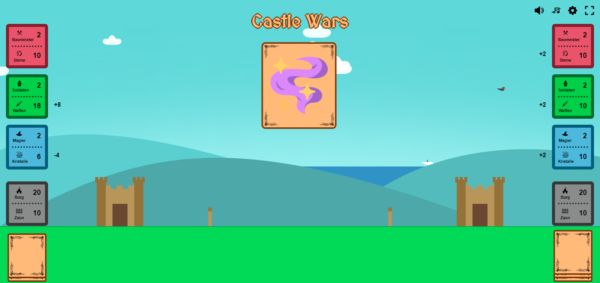
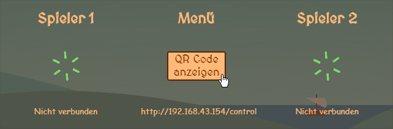

# Castle Wars

Castle Wars ist ein Multiplayer und mit dem Smartphone steuerbares Kartenspiel.
Du bist anstrebender König und Dein Ziel ist es, die größte Burg des Königsreichs zu besitzen.
Ein ebenso wirkungsvoller Plan ist, die Burg deines Konkurrenten komplett zu zerstören.

## Anleitung
**Wann gewinnst du?**
* Deine Burg ist 100 Steine hoch ***oder***
* Du hast die gegnerische Burg zerstört

**Wie gewinnst du?**
* Benutze deine Karten um deine Burg zu erhöhen oder die Gegnerische zu schwächen
* Deine Karten kosten Rohstoffe: Steine, Waffen und Kristalle
* Baumeister, Soldaten und Magier liefern Dir jede Runde die entsprechenden Rohstoffe
* Beispiel: 5 Baumeister = 5 neue Steine pro Runde

**Wie wird gespielt?**
* Das Spiel ist rundenbasiert 
* Jede Runde darfst Du eine Karte, sofern Du sie Dir leisten kannst, spielen
* Kannst Du Dir keine einzige Karte auf deiner Hand leisten oder möchtest eine Karte loswerden kannst Du sie
mit längerem Drücken abwerfen
 *Damit ist Dein Zug jedoch verbraucht*

## Installation
1. git-Repository herunterladen
2. `install.bat` im Hauptverzeichnis zur Installation ausführen 
2. `start.bat` zum Starten des Spiels ausführen
3. `localhost` im Browser öffnen (*passiert automatisch*)
4. QR-Code scannen *oder* IP (z.B. 192.168.1.1/control) manuell in Smartphone Browser eingeben

## Anforderungen
Um die Verbindung zwischen PC und Smartphone sicherzustellen müssen sich alle Geräte im selben
(Wifi) Netzwerk befinden.

Software
* Node.js 8.11.4 (oder höher)

Hardware
* 1 PC zur Spielfeld-Anzeige
* 1 Smartphone je Spieler 
*bevorzugt Android, bei iOS Geräten können Probleme auftreten*

Browser
* Google Chrome 68.0 (oder höher)
* Mozilla Firefox 62.0 (oder höher)

## Bugs

### Verbindungsprobleme
Solltest Du während dem Spiel die Verbindung verlieren, Neuladen oder versehentlich die Seite schließen,
 wird das Spiel im Normalfall automatisch fortgesetzt, sobald Du dich wieder auf der Seite befindest.
Wenn Du jedoch im "Join"-Screen hängen bleibst solltest Du einfach noch einmal neuladen. 

### Millionen Vögel...
Lässt Du den Browser im Hintergrund offen, kommt es schonmal vor, dass in der Zwischenzeit einige Vögel 
spawnen und den Browser stark verlangsamen. In diesem Fall musst Du einfach die Seite neuladen.

***

**Autoren** 
Daniel Schmitz 
Martin Rempel

**Erstelldatum** 
28.06.018

**Version** 
1.0

****

**Aufgabenverteilung**

Martin Rempel
* Smartphone Steuerung

Daniel Schmitz
* Canvas / Host-Anzeige
* Backend / Game-Logik
